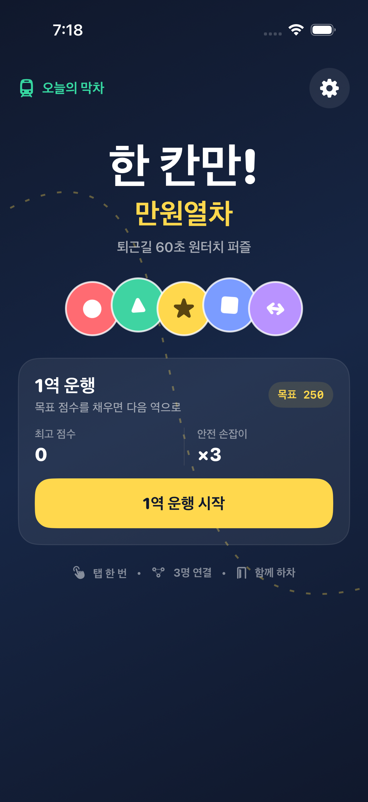
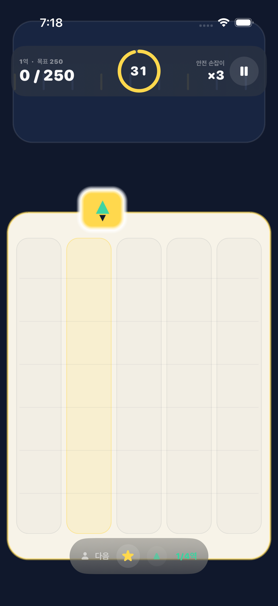

# 한 칸만! 만원열차

한국 App Store 무료 게임 차트 1위 도전을 목표로 만든 iPhone용 네이티브 게임 MVP입니다. 움직이는 문에 맞춰 승객을 한 칸에 태우고, 같은 목적지 배지 3명 이상을 연결해 하차시키는 60초 원터치 퍼즐입니다.




## 지금 플레이할 수 있는 것

- 5열 × 7행 퍼즐 보드와 32~60초 스테이지
- 자동 왕복하는 문 선택기와 원터치 배치
- 같은 배지 3명 연결, 연쇄 하차, 환승객 와일드카드
- 1역의 쉬운 성공 경험부터 20역 이후 고난도까지 이어지는 목표 점수 곡선
- 초반 3개에서 중후반 1개·0개로 줄어드는 판 내부 `안전 손잡이`
- 2회 연속 실패 시 화면에 표시되는 혼잡 완화 운행
- 첫 구조 무료, 이후 판당 한 번 선택 가능한 보상형 광고 구조 상태
- 매일 모두에게 같은 승객 순서를 주는 일일 시드
- 첫 실행 튜토리얼, 일시정지, 결과, 즉시 재도전, 친구 기록 공유
- 최고 점수·누적 운행·튜토리얼 상태 로컬 저장
- 햅틱 설정, SwiftUI 전환의 Reduce Motion 대응, VoiceOver 레이블

## 기술 구성

- Swift 6, SwiftUI, SpriteKit
- iPhone 세로 화면, iOS 17 이상
- 외부 패키지 없음
- 순수 Swift 규칙 엔진과 SpriteKit 렌더링 분리
- `PrivacyInfo.xcprivacy` 포함
- 규칙·난이도·저장 마이그레이션 유닛 테스트 10개와 첫 실행 UI 테스트

## 실행

1. `AppStoreGame.xcodeproj`를 Xcode 26 이상에서 엽니다.
2. `AppStoreGame` 스킴과 iPhone 시뮬레이터를 선택합니다.
3. Run을 누릅니다.

실기기 배포 전에는 프로젝트의 임시 번들 ID `com.example.OneMoreCar`를 보유한 식별자로 바꾸고 Signing Team을 지정해야 합니다.

규칙 엔진만 빠르게 테스트하려면:

```sh
swift test --disable-sandbox --scratch-path .build/swiftpm
```

전체 iOS 테스트는 Xcode의 Product → Test에서 실행할 수 있습니다.

## 제품 판단

현재 결과물은 코어 재미와 출시 가설을 검증할 수 있는 vertical slice입니다. Debug 빌드에는 보상 콜백을 검증하는 모의 광고가 있고, Release 빌드는 실제 광고 SDK가 연결될 때까지 광고 CTA를 숨깁니다. App Store 제출 완성본에는 실기기 성능·오디오·Game Center Challenges·분석 이벤트·실제 광고 SDK·법률 문서·TestFlight 밸런스 검증이 추가로 필요합니다. 차트 1위는 코드만으로 보장할 수 없으며, 제품 완성도와 사전예약·크리에이터·광고 집행이 같은 48시간에 결합되어야 합니다.

시장 근거, KPI와 출시 계획은 [2026 한국 App Store 전략](docs/2026-korea-appstore-strategy.md)에 정리했습니다.
목숨·광고·친구 초대에 대한 재검토는 [유지율·수익화 판단](docs/retention-monetization-decision.md)에 별도로 정리했습니다.

## 자산과 라이선스

앱 아이콘 제작 기록은 [자산 출처 기록](docs/ASSET_PROVENANCE.md)에 남겼습니다. 아직 오픈소스 라이선스를 선택하지 않았으므로 `LICENSE` 파일이 없으며, 별도 허락 없이 저장소의 코드와 자산을 재사용할 권리는 부여되지 않습니다.
