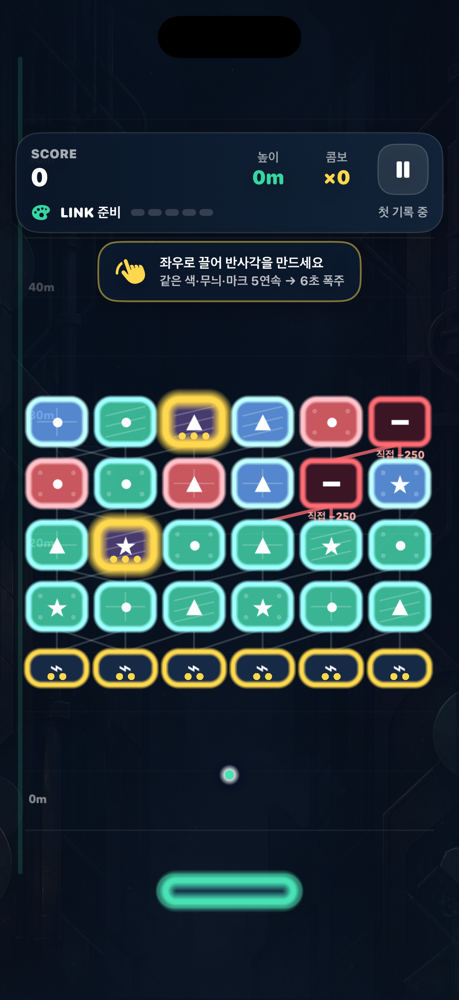
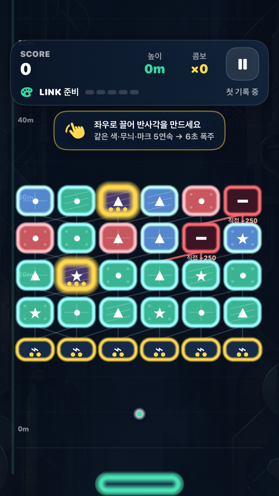

# 연쇄파괴: 리턴 샷

한국 App Store 무료 게임 1위를 목표로 검증 중인 iPhone 세로형 endless 아케이드 프로토타입입니다. 공이 움직이는 동안 한 엄지로 패들을 계속 끌어 반사각을 바꾸고, 속성 연쇄와 구조 붕괴로 같은 seed의 개인 기록을 높입니다.

> 현재 단계: **Stage 6 Implementation — Visual MVP Go / 전체 Product Gate Revise**
>
> 실제 사용자 재미·D1/D7·한국 CPI/LTV·차트 진입 가능성은 아직 검증되지 않았습니다.




## 지금 플레이할 수 있는 것

- 접촉 위치와 패들 이동 속도로 다음 반사각을 만드는 지속 드래그
- 점수·높이·콤보·개인 최고 기록 추격과 동일 seed 재도전
- 색·무늬·마크를 독립적으로 잇는 5-LINK, 6초 `공명 폭주`
- 세 번 맞혀야 깨지는 프리즘 보너스 벽돌
- 직접 맞히면 `−250`, 지지점을 끊어 떨어뜨리면 `+120`인 마이너스 벽돌
- 120Hz 고정 tick, swept collision, 결정론적 support graph collapse
- 홈·설정·일시정지·결과·공유와 A/B 시각 변형
- 광고, 계정, 친구 설치, 서버, 유료 부스터 없음

## 실행과 검증

1. Xcode 26 이상에서 `AppStoreGame.xcodeproj`를 엽니다.
2. `AppStoreGame` 스킴과 iPhone 시뮬레이터를 선택합니다.
3. Run을 누릅니다.

빠른 규칙 테스트:

```sh
swift test --scratch-path /private/tmp/ReturnShotSwiftPM
```

전체 iOS 테스트:

```sh
xcodebuild -project AppStoreGame.xcodeproj -scheme AppStoreGame \
  -destination 'platform=iOS Simulator,name=iPhone 17 Pro,OS=26.5' \
  -derivedDataPath /private/tmp/ReturnShotTestDerived \
  CODE_SIGNING_ALLOWED=NO test
```

2026-08-18 로컬 증거는 SwiftPM 12/12, Xcode 규칙 12/12, UI 흐름 1/1입니다. UI 흐름은 홈→시작→드래그→일시정지→재개→결과→동일 seed 재도전을 포함합니다. 번들 ID는 `com.keestory.returnshot`이지만, 실기기 배포 전 Apple Developer 소유권 확인과 Signing Team 지정이 필요합니다.

## A/B와 디자인

- 기본 A `Precision Neon`: 중립 지지선으로 판단 대상 우선
- challenger B `Impact Pop`: 보너스 에너지는 강하지만 노란 연결망의 시각 부하가 큼
- gameplay truth는 SpriteKit/SwiftUI 코드로 렌더하고 ImageGen 자산은 저대비 배경과 앱 아이콘에만 사용

상세 화면 감사와 디자인 규칙은 [Visual Builder Report](docs/04-design/return-shot-visual-builder-report-2026-08-17.md), 권리·해시는 [Asset Provenance](docs/ASSET_PROVENANCE.md)에 있습니다.

## 다음 Gate

- 5명 중 4명: 설명 없이 5초 안에 첫 리턴
- 5명 중 3명: 자발적 3회차
- Run 3 기록 중앙값: Run 1 대비 `+20%`
- VoiceOver·Dynamic Type·Reduce Motion 및 최소 지원 실기기 10분 soak
- 무광고 retention 통과 뒤에만 수익화 실험

## Source of Truth

- [제품 개발 멀티 에이전트 플레이북](docs/PRODUCT_DEVELOPMENT_MULTI_AGENT_PLAYBOOK_2026.md)
- [Return Shot ProductSpec rev2](docs/product-specs/return-shot-chain.product-spec.md)
- [Decision Log](docs/00-brief/decision-log.md)
- [Architecture](docs/05-engineering/architecture.md)
- [Test Plan](docs/06-quality/test-plan.md)
- [Release Checklist](docs/06-quality/release-checklist.md)

## 라이선스

아직 오픈소스 라이선스를 선택하지 않았습니다. 별도 허락 없이 코드와 자산을 재사용할 권리는 부여되지 않습니다.
