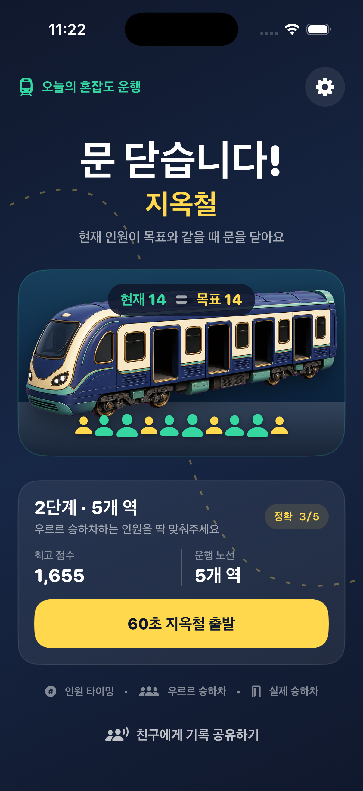
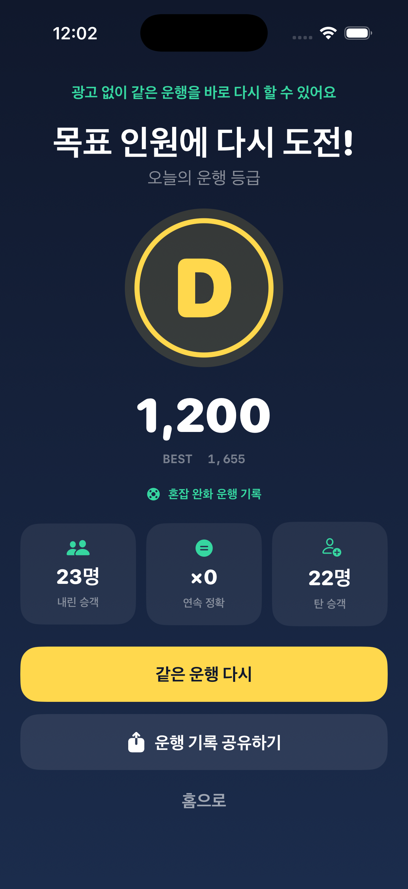

# 문 닫습니다! 지옥철

한국 App Store 무료 게임 차트 1위에 도전하기 위한 iPhone용 네이티브 게임 프로토타입입니다. 각 역에서 승객이 먼저 내리고 사람들이 우르르 타기 시작하면, **현재 인원이 목표 인원과 같아지는 순간 문을 닫는** 60초 원탭 게임입니다.

> 현재 단계: **Product Harness Discovery / Solution Validation — Revise-Go**
> 게임 후보로서 구현·검증할 가치는 있지만, 사용자 유지율·한국 CPI·LTV·필요 설치량이 아직 없으므로 “1위 가능”이나 출시 준비 완료로 판정하지 않습니다.




## 지금 플레이할 수 있는 것

- 오너가 제공하고 승인한 세로형 2.5D 디오라마 마스터 구도, 네 개의 문, 야간 통근 분위기, 상단 아이콘 HUD와 하단 금색 레버
- `자동 하차 → 단조 증가하는 탑승 → 목표 인원 순간 문 닫기 → 정확/안전/초과 판정` 루프
- 서로 다른 시작·목표 인원을 가진 결정론적 5개 역, 약 60초 운행
- 첫 역은 목표 숫자를 최소 1.2초, 이후 역은 최소 0.6초 유지해 처음부터 억울하게 놓치지 않는 난이도
- 화면에서 승객이 문턱을 통과하는 이벤트와 권위 인원 숫자의 1:1 동기화
- 정확히 맞으면 `정확`, 한 명 차이면 `안전`, 그 외에는 부족·초과 인원을 설명하는 결과
- 큰 문 닫기 조작, 사운드·햅틱, 일시정지, Reduce Motion, VoiceOver 설명, 무료 재시도
- 첫 3회 무광고 원칙. 광고·구매·친구 설치 없이는 풀 수 없는 역을 만들지 않음

## 기술 구성과 검증

- Swift 6, SwiftUI, SpriteKit, iOS 17 이상, iPhone 세로
- 외부 패키지 없는 순수 Swift 규칙 엔진과 SpriteKit 렌더러 분리
- 10,000개 seed × 5개 역의 용량·도달 가능성 검증
- 30/60/120Hz와 큰 프레임 지연에서도 같은 인원 결과를 내는 결정론적 clock
- stale 입력, 중복 판정, 정확/부족/초과, 자동 하차 후 탑승 순서 테스트
- SwiftPM 32/32, Xcode 앱 테스트 41/41 통과

## 실행

1. `AppStoreGame.xcodeproj`를 Xcode 26 이상에서 엽니다.
2. `AppStoreGame` 스킴과 iPhone 시뮬레이터를 선택합니다.
3. Run을 누릅니다.

실기기 배포 전에는 임시 번들 ID `com.example.OneMoreCar`를 보유한 식별자로 바꾸고 Signing Team을 지정해야 합니다.

규칙 엔진만 빠르게 테스트하려면:

```sh
swift test --disable-sandbox --scratch-path .build/swiftpm
```

## 제품 판단

현재 채택안은 프로젝트 오너가 기각한 `정차선 제동`과 `목적지 문양 맞추기`를 대체합니다. 지나가는 열차에 사람을 넣는 타이밍 후보도 검토했지만, 위험 행동으로 읽힐 가능성과 역할 모호성이 있어 제외했습니다. `지옥철 목표 인원 문닫기`는 실제 열차·문·군중·숫자·타이밍이 하나의 인과로 연결되어 현재 가장 강한 challenger입니다.

다만 한국 무료 차트 Top 25의 직접 동일 장르 근거와 개별 경쟁작 D1/D7은 없습니다. 다음 Gate는 한국 iPhone 사용자 10명 중 8명 이상이 설명 없이 첫 문닫기를 이해하고, 5명 중 3명 이상이 자발적으로 세 번째 운행을 시작하는지 확인하는 것입니다. 그 뒤에만 무광고 D1/D7, 한국 CPI/LTV, opt-in 광고를 순서대로 검증합니다.

## Product Harness와 개발 지침

- 개발 지침: [2026 제품 개발 멀티 에이전트 플레이북](docs/PRODUCT_DEVELOPMENT_MULTI_AGENT_PLAYBOOK_2026.md)
- 현재 Source of Truth: [ProductSpec rev4](docs/product-specs/real-train-braking.product-spec.md)
- 의사결정 이력: [Decision Trace](docs/decision-traces/real-train-braking.decision-trace.json)
- 기각안 보관: [rev1 제동](docs/product-specs/archive/real-train-braking.rev1.product-spec.md), [rev2 문양 라우팅](docs/product-specs/archive/platform-routing.rev2.product-spec.md)
- 시장 근거: [Evidence Register](docs/01-research/evidence-register.md), [Competitor Matrix](docs/01-research/competitor-matrix.md)
- 품질 계약: [Acceptance Criteria](docs/03-product/acceptance-criteria.md), [Test Plan](docs/06-quality/test-plan.md), [Release Checklist](docs/06-quality/release-checklist.md)
- 자산 기록: [Asset Provenance](docs/ASSET_PROVENANCE.md)

## 라이선스

아직 오픈소스 라이선스를 선택하지 않았으므로 `LICENSE` 파일이 없습니다. 별도 허락 없이 저장소의 코드와 자산을 재사용할 권리는 부여되지 않습니다.
