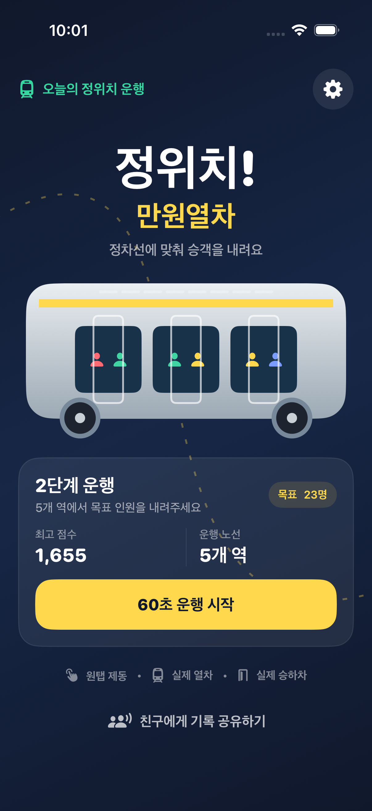
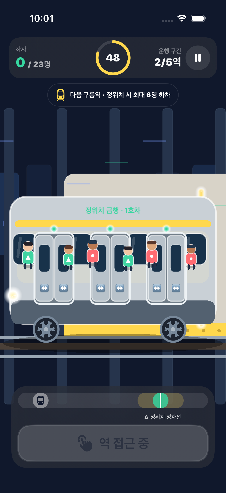

# 정위치! 만원열차

한국 App Store 무료 게임 차트 1위 도전을 목표로 만든 iPhone용 네이티브 게임 프로토타입입니다. 달리는 실제 지하철을 노란 정차선에 맞춰 한 번 탭하고, 세 쌍의 문이 열리며 사람 형태 승객이 직접 타고 내리는 60초 게임입니다.

> 현재 단계: **Stage 4 Solution Definition 재작업 — Revise**
> 이 저장소의 앱은 검증 전 vertical slice입니다. 실제 사용자 인터뷰와 최소 5명 사용성 테스트가 없으므로 출시 후보나 1위 가능성이 검증된 제품으로 보지 않습니다.




## 지금 플레이할 수 있는 것

- 차체·창문·바퀴·선로·플랫폼·전조등이 보이는 실제 측면 지하철
- 세 쌍의 미닫이문과 사람 형태 승객의 실제 승하차 애니메이션
- `접근 → 원탭 제동 → 정차 판정 → 문 개방 → 승하차 → 출발` 5개 역·60초 루프
- 첫빛역의 넓은 판정에서 달빛역의 좁은 판정으로 상승하는 난이도
- 정위치·안전 정차·가까움·통과의 결정론적 판정과 하차 인원 계산
- 터널·도시·선로 패럴랙스, 정위치 차표 파티클, 급정차 불꽃·흔들림
- 런타임 합성 사운드, 햅틱, 사운드/햅틱 개별 설정
- 첫 운행 무료 추가 역, 실제 SDK 전 Release 광고 CTA 숨김, 무료 즉시 재시도
- 첫 실행 비차단 coachmark, 일시정지, 결과, 운행 기록 공유
- Reduce Motion에서 비필수 배경 스크롤·진동·흔들림·파티클 제거

## 기술 구성

- Swift 6, SwiftUI, SpriteKit
- iPhone 세로 화면, iOS 17 이상
- 외부 패키지 없음
- 순수 Swift 규칙 엔진과 SpriteKit 렌더링 분리
- `PrivacyInfo.xcprivacy` 포함
- 순수 규칙 17개, AppModel 7개, 실제 5역·60초 Scene 통합 1개, 첫 실행 UI smoke 1개 자동 테스트

## 실행

1. `AppStoreGame.xcodeproj`를 Xcode 26 이상에서 엽니다.
2. `AppStoreGame` 스킴과 iPhone 시뮬레이터를 선택합니다.
3. Run을 누릅니다.

실기기 배포 전에는 프로젝트의 임시 번들 ID `com.example.OneMoreCar`를 보유한 식별자로 바꾸고 Signing Team을 지정해야 합니다.

규칙 엔진만 빠르게 테스트하려면:

```sh
swift test --disable-sandbox --scratch-path .build/swiftpm
```

전체 iOS 테스트는 Xcode의 Product → Test에서 실행할 수 있습니다.

## 제품 판단

현재 결과물은 코어 재미와 출시 가설을 검증할 vertical slice입니다. 움직이는 열차는 무료 차트 획득 훅 후보지만, 한국 최고매출 Top 25의 열차 게임 근거와 본 제품 유지 데이터는 없습니다. Debug 빌드에는 보상 콜백용 모의 광고가 있고 Release 빌드는 실제 SDK 연결 전 광고 CTA를 숨깁니다. 첫 3판 무광고와 무료 재시도가 기본이며 친구 설치·가입 보상은 범위 밖입니다.

최신 시장 판단의 Source of Truth는 [실제 열차 시장 재조사](docs/01-research/real-train-refresh-2026-08-09.md)와 [Market Map](docs/01-research/market-map.md)입니다. 구 전략·수익화 문서는 역사적 가설이며 최신 문서와 충돌하면 최신 재조사가 우선합니다.
목숨·광고·친구 초대의 과거 검토는 [유지율·수익화 판단](docs/retention-monetization-decision.md)에 남겨 두되 확정 정책으로 사용하지 않습니다.

## 플레이북과 Gate 문서

- 운영 원칙: [2026 제품 개발 멀티 에이전트 플레이북](docs/PRODUCT_DEVELOPMENT_MULTI_AGENT_PLAYBOOK_2026.md)
- Product Harness: [Product Spec rev 1](docs/product-specs/real-train-braking.product-spec.md), [Decision Trace](docs/decision-traces/real-train-braking.decision-trace.json)
- 현재 결정: [Gate Report](docs/00-brief/gate-report.md), [Decision Log](docs/00-brief/decision-log.md), [Risk Register](docs/00-brief/risk-register.md)
- 시장 근거: [Evidence Register](docs/01-research/evidence-register.md), [Competitor Matrix](docs/01-research/competitor-matrix.md), [User Research Plan](docs/01-research/user-interviews.md)
- 제품 계약: [Draft PRD](docs/03-product/prd.md), [Acceptance Criteria](docs/03-product/acceptance-criteria.md), [Analytics Plan](docs/03-product/analytics-plan.md)
- 설계·품질: [Accessibility Audit](docs/04-design/accessibility-checklist.md), [Architecture](docs/05-engineering/architecture.md), [Test Plan](docs/06-quality/test-plan.md), [Release Checklist](docs/06-quality/release-checklist.md)

다음 Gate를 위해 JTBD 인터뷰 12명과 사용성 테스트 5명이 필요합니다. 5명 중 5명이 2초 안에 열차로 식별하고, 4명이 5초 안에 제동 목표를 이해하고 자발적으로 두 번째 운행을 시작해야 합니다. 그 전에는 친구 설치 보상, 실제 광고 SDK, 시즌 패스 같은 성장·수익 기능을 추가하지 않습니다.

## 자산과 라이선스

앱 아이콘 제작 기록은 [자산 출처 기록](docs/ASSET_PROVENANCE.md)에 남겼습니다. 아직 오픈소스 라이선스를 선택하지 않았으므로 `LICENSE` 파일이 없으며, 별도 허락 없이 저장소의 코드와 자산을 재사용할 권리는 부여되지 않습니다.
