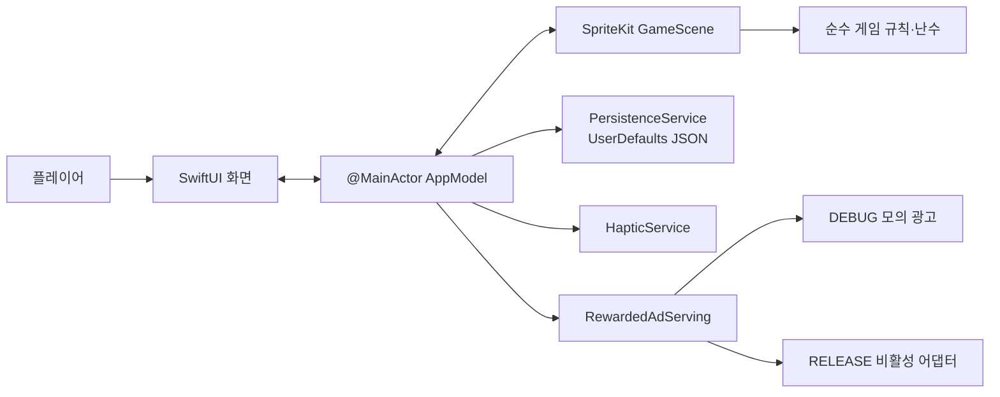
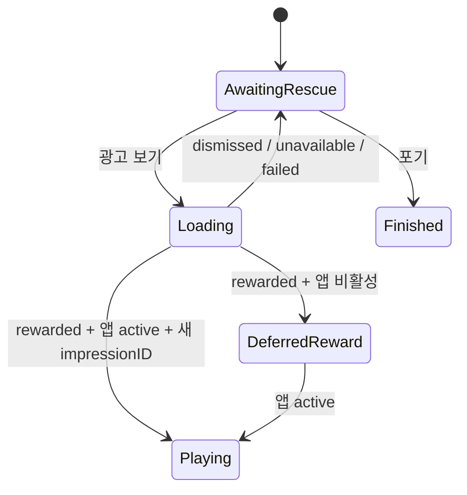

# 한 칸만 기술 아키텍처

- 상태: vertical slice 구현 기준 감사 완료
- 감사 기준일: 2026-08-09 (KST)
- 대상: iPhone 세로형 SwiftUI/SpriteKit 앱, iOS 17 이상
- 도구 기준: Xcode 26.6, Swift 6.3.3 확인
- 현재 외부 런타임 의존성/서버: 없음

## 1. 시스템 경계

현재 네트워크 호출, 계정, 원격 데이터베이스, 푸시, 분석·광고 SDK는 없다. `RewardedAdServing`은 향후 SDK를 격리하기 위한 내부 경계이고 Release 빌드에서는 항상 unavailable이다.

## 2. 구성요소와 책임

| 구성요소 | 책임 | 금지/경계 |
|---|---|---|
| `AppStoreGameApp`, `RootView` | 앱 진입, 화면 라우팅, `scenePhase` 전달 | 게임 규칙과 저장 로직을 두지 않는다 |
| `AppModel` | 화면 상태, Scene 이벤트 조정, 프로필 저장, 구조 보상 오케스트레이션 | 광고 SDK 타입을 직접 참조하지 않는다 |
| `GameScene` | 프레임 루프, 입력, SpriteKit 노드, 실행 상태 전이 | 영구 저장·네트워크를 하지 않는다 |
| `GameRules`, `TrainBoard` | 결정론적 규칙, 난이도, 보드 해석 | UI·시간·I/O에 의존하지 않는다 |
| `PersistenceService` | `PlayerProfile` JSON의 로드·저장 | 민감정보와 진행 중 런을 저장하지 않는다 |
| `RewardedAdServing` | 광고 결과를 도메인 결과로 변환 | 보상 확정 전에 게임 상태를 변경하지 않는다 |
| `HapticService` | 사용자 설정을 반영한 햅틱 | 필수 피드백의 유일한 채널이 되지 않는다 |

근거 파일: `AppStoreGame/App/AppModel.swift`, `AppStoreGame/Game/GameScene.swift`, `AppStoreGame/Game/GameRules.swift`, `AppStoreGame/Core/*.swift`.

## 3. 상태와 동시성

- UI, AppModel, Scene, 서비스 프로토콜은 MainActor 경계에서 조정한다.
- 정상 런 상태는 `ready → playing ↔ paused → awaitingRescue → playing|finished`이다.
- `GameScene.update`는 프레임 간격을 최대 1/30초로 제한하고 일시정지 해제 시 기준 시간을 초기화한다.
- `RootView`는 `scenePhase`를 `AppModel.setApplicationActive`로 전달한다. AppModel은 광고 요청 시점의 `activeRunID`와 Scene identity를 callback 시 다시 대조해 낡은 런의 결과를 폐기한다.
- 비활성 상태에서 확정된 reward는 프로필에 1회 기록하고 `pendingRewardRunID`로 보류한다. active 복귀 후 구조 화면의 `받은 보상으로 구조 계속`을 명시적으로 눌러야 Scene이 재생된다.
- 보상 결과는 `impressionID`를 메모리 집합으로 중복 제거한다. 동일 프로세스에서는 중복 지급을 막지만 재실행을 넘는 영속 멱등성은 제공하지 않는다.

### 보상형 구조의 필수 상태 전이

보상은 광고 SDK의 단순 닫힘 콜백이 아니라 검증된 reward 콜백에서만 확정해야 한다. 활성 상태가 아닐 때는 보상을 기록하되 Scene 재개를 active 복귀까지 보류한다.

## 4. 데이터 흐름

1. 터치 입력은 `GameScene`에서 보드 규칙으로 전달된다.
2. 규칙 결과는 `GameEvent`로 `AppModel`에 전달되고 SwiftUI가 `RunSnapshot`을 렌더링한다.
3. 런 종료 또는 설정 변경 때 최소 프로필만 UserDefaults에 저장한다.
4. 현재 기기 밖으로 나가는 앱 데이터는 없다. 분석 및 실제 광고 도입 시 이 전제는 무효가 되며 보안·개인정보 재심사가 필요하다.

## 5. 빌드와 배포 경계

- `Package.swift`: 게임 모델·규칙의 빠른 결정론 테스트용. 앱 전체를 대표하지 않는다.
- `AppStoreGame.xcodeproj`: 앱, 단위 테스트, UI 테스트의 권위 있는 산출물.
- 현재 CI는 `swift test`만 실행한다. 로컬 generic iOS Simulator 빌드는 성공했으나 앱 빌드/테스트를 CI가 강제하지 않는다.
- Debug는 모의 보상을 사용하고 Release는 광고 비활성이다. 실제 매출 기능으로 오인하면 안 된다.
- `DEVELOPMENT_TEAM`이 비어 있고 번들 ID가 `com.example.OneMoreCar`이므로 Archive/TestFlight/App Store 서명은 아직 준비되지 않았다.

## 6. 품질 속성

| 속성 | 구현 기준 | 현재 판정 |
|---|---|---|
| 결정성 | 같은 seed와 입력은 같은 규칙 결과 | 단위 테스트 통과 |
| 성능 | 게임 루프에 네트워크·디스크 I/O 없음, delta 제한 | 기본 구조 충족; 기기 계측 미실시 |
| 복원성 | 손상·구버전 저장은 안전한 기본값/명시 migration | v1과 future-version 거부·recovery 보존 테스트 통과 |
| 접근성 | 버튼 식별자, Dynamic Type/VoiceOver/감각 대체 | 첫 경로만 부분 검증; 정식 감사 미실시 |
| 관측성 | 핵심 퍼널·오류·크래시 신호와 릴리스 상관관계 | 구현 없음(P1) |
| 프라이버시 | 수집 최소화, manifest/SDK 데이터 흐름 일치 | 현 SDK 없는 빌드 기준 충족 |

## 7. 변경 규칙

서버, 광고/분석 SDK, 계정, 원격 구성, 딥링크 수신, 클라우드 저장을 추가할 때는 별도 ADR, 데이터 흐름도, 위협 모델, PrivacyInfo/App Store 개인정보 답변, 테스트 및 롤백 방안을 함께 변경한다. 자세한 계약은 [api-contract.md](api-contract.md), 모델은 [data-model.md](data-model.md), 결정은 [ADR-0001](adr/0001-native-ios-vertical-slice.md)을 따른다.
