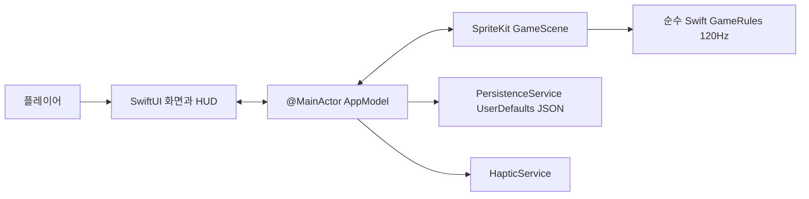

# Return Shot 기술 아키텍처

- 기준일: 2026-08-18 KST
- 단계: Stage 6 Implementation
- 대상: iPhone 세로형 SwiftUI/SpriteKit 앱, iOS 17+
- 런타임 외부 패키지·서버·계정·광고·분석 SDK: 없음

## 시스템 경계

| 구성요소 | 책임 | 경계 |
|---|---|---|
| `RootView`, SwiftUI Views | 홈·설정·HUD·일시정지·결과·공유 | 권위 점수·충돌을 계산하지 않음 |
| `AppModel` | 화면 흐름, 현재 Scene identity, 프로필 저장, 이벤트 조정 | SpriteKit 노드를 보관하지 않음 |
| `GameScene` | 터치·렌더·효과·고정 tick 호출 | 저장·네트워크·경제 로직 없음 |
| `GameRules` | 결정론적 반사·충돌·점수·LINK·붕괴·segment 생성 | UI, wall clock, I/O 의존 없음 |
| `PersistenceService` | versioned `PlayerProfile` JSON | 민감정보·진행 중 런 저장 없음 |
| `HapticService` | 설정을 반영한 보조 피드백 | 필수 정보의 유일한 채널이 아님 |

## 권위 게임 루프

1. `GameScene`이 목표 패들 x를 수집한다.
2. accumulator가 `GameRules.tickDuration`마다 순수 규칙을 한 번 실행한다.
3. 규칙은 swept collision과 안정된 ID 순서로 이벤트를 반환한다.
4. Scene은 이벤트를 시각·햅틱 효과로 표현하고 `RunSnapshot`을 AppModel에 전달한다.
5. 애니메이션·파편·충격파 표현은 권위 점수와 충돌을 변경하지 않는다.

렌더 주사율이 30/60/120Hz여도 quantized 입력이 같으면 checksum과 결과가 같아야 한다. 공의 권위 상단 경계는 `540pt`이며 HUD·coachmark 예약 band에 진입할 수 없다. 판정 그래프에 존재하는 모든 support edge를 화면에도 그린다.

## 상태와 수명주기

- 런 상태: `playing ↔ paused → finished`.
- background/inactive 진입 시 AppModel이 현재 Scene만 일시정지하며 자동 재개하지 않는다.
- Scene 이벤트는 현재 Scene identity와 active run에 속할 때만 반영한다.
- miss 뒤 결과로 이동하고 `같은 구조 다시`는 같은 seed의 새 Scene을 만든다.
- `-uiTesting`은 프로필과 seed를 격리하고 `-uiTestingFastFail`은 재개 뒤에만 종료를 arm한다.

## 데이터와 프라이버시

- 저장: 최고 점수·높이·콤보·런 수, 설정, 튜토리얼 여부.
- 기기 밖 전송: 없음.
- 민감정보·위치·연락처·사진·광고 식별자: 수집하지 않음.
- 분석, 광고, 계정, 딥링크, 클라우드 저장을 추가하면 별도 ADR·위협 모델·PrivacyInfo·App Store 개인정보 답변·롤백 계획이 필요하다.

## 접근성 경계

- gameplay signature는 색과 함께 무늬·마크·형태를 사용한다.
- HUD와 메뉴는 semantic text style과 44pt 컨트롤을 우선한다.
- SpriteView는 점수·높이·콤보·LINK를 하나의 접근성 값으로 제공하고 adjustable/custom action으로 패들을 48pt씩 이동할 수 있다.
- Reduce Motion은 배경 drift·trail·비필수 effect를 제거한다.
- VoiceOver·최대 Dynamic Type·Increase Contrast·Switch Control 실기기 검증은 Release blocker다.

## 빌드와 배포

- `Package.swift`: 모델·규칙의 빠른 결정론 테스트.
- `AppStoreGame.xcodeproj`: 앱·Xcode unit·UI test의 권위 산출물.
- 번들 ID: `com.keestory.returnshot`; Development Team은 아직 비어 있다.
- 2026-08-18 로컬: SwiftPM 12/12, Xcode unit 12/12, UI 1/1.
- 원격 CI는 앱 unit/UI/Release archive를 아직 필수 체크로 강제하지 않는다.

## Release 전 필수

Signing Team과 bundle ownership, signed archive/export, pace ghost와 실제 quantized input replay, 최소 지원 실기기 10분 soak, VoiceOver/Dynamic Type/Reduce Motion, 핵심 퍼널·크래시 관측성, App Store 메타데이터·자산 권리 검토가 필요하다.
