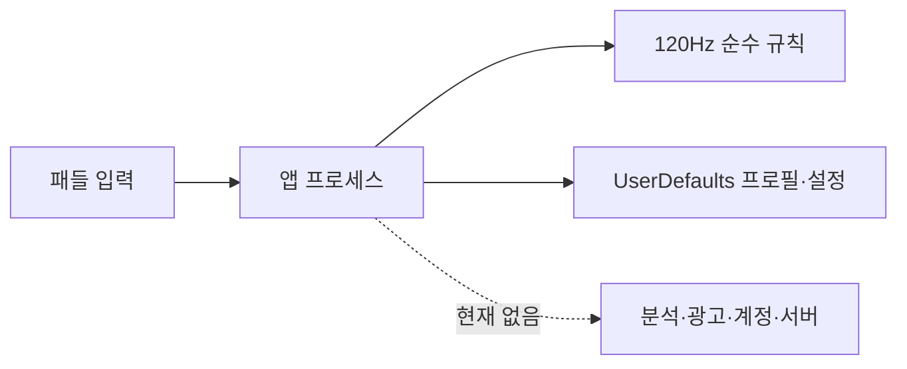

# Return Shot 보안·개인정보 검토

- 검토일: 2026-08-18 KST
- 범위: 저장, 입력 무결성, SDK/secret, PrivacyInfo, 빌드 공급망
- 결론: 현 local-only Visual MVP의 개인정보 표면은 작지만 출시 서명·원격 archive·App Store Connect 검증은 준비되지 않았다.

## 현재 신뢰 경계

보호 자산은 기록 무결성, raw recovery payload, 빌드 서명 자격증명, App Store 개인정보 고지다. 현재 앱 프로세스 밖 데이터 흐름은 없다.

## 점검 결과

| 항목 | 결과 | 남은 조치 |
|---|---|---|
| secret pattern | working tree 강한 패턴 미발견 | 원격 history/host secret scan 확인 |
| 인증서·프로비저닝 | 추적 파일 없음, ignore 대상 | 최소 권한 App Store Connect key와 rotation |
| 외부 package/SDK | 없음 | 도입 시 signature·SBOM·license·privacy 재감사 |
| local profile | PII 없음, future version fail closed, raw recovery | save 오류 관측·recovery UI 필요 |
| 게임 규칙 무결성 | 120Hz·swept collision·stable event order | 실제 input replay proof/서버 권위 없음 |
| PrivacyInfo | tracking false, collected data empty, UserDefaults reason | archive와 App Store Connect 답변 교차 확인 |
| asset provenance | ImageGen source·hash, 과거 열차 asset runtime 제거 | 최종 상표·유사성·사용권 확인 |
| CI supply chain | GitHub workflow 존재 | 앱 unit/UI/Release archive required check와 action SHA pin 필요 |

## 위험 등록부

| ID | 등급 | 위험 | 현재 통제 | 최소 완화 |
|---|---|---|---|---|
| SEC-01 | P1 Release | Development Team·bundle ownership·signed archive 부재 | unsigned simulator test | 소유 ID와 clean archive/export |
| SEC-02 | P1 | 저장 실패·recovery가 사용자에게 보이지 않음 | crash 방지·raw backup | 오류 코드, 복구 UX, fixture |
| SEC-03 | P1 Scale | client score 조작 | 현재 개인 PB만 사용 | leaderboard 전에 replay/server authority |
| SEC-04 | P1 도입 시 | SDK가 선언 밖 데이터 수집 | 현재 SDK 없음 | data-flow·PrivacyInfo·ATT·kill switch Gate |
| SEC-05 | P2 | CI action tag 이동 | 제한적 workflow | immutable full SHA pin |

## 외부 SDK 도입 Gate

공급자·정확한 version·signature·SBOM·license, 수집/파생/공유 필드, 목적·보존·삭제, ATT 판단, PrivacyInfo와 App Store 답변, 실패 시 core gameplay 유지, 원격 kill switch, secret 분리를 모두 증명하기 전 merge하지 않는다. 광고·IAP는 no-ad retention Gate 뒤에만 실험한다.

## 개인정보 결론

`NSPrivacyTracking=false`, 빈 수집 목록, UserDefaults required-reason은 현재 소스와 정합하다. 이는 정적/시뮬레이터 증거이며 signed archive의 포함 SDK, 실제 네트워크 트래픽, App Store Connect 답변은 아직 `Unknown`이다.
