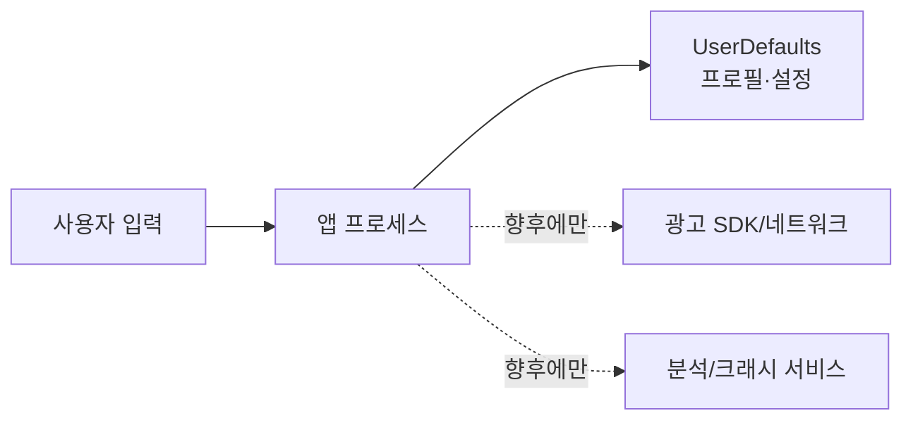

# 보안·개인정보 검토

- 검토일: 2026-08-09
- 범위: 저장, 광고 경계, SDK/secret, PrivacyInfo, CI 공급망
- 결론: 현 로컬-only Debug vertical slice의 개인정보 표면은 작지만 실제 광고/분석 SDK 및 출시 서명은 준비되지 않았다.

## 1. 자산과 신뢰 경계

보호 자산은 플레이 기록, 보상 구조의 무결성, 빌드 서명 자격증명, App Store 개인정보 고지의 정확성이다. 현재 앱 프로세스 밖 데이터 흐름은 없으며 UserDefaults만 사용한다. Debug mock은 외부 광고가 아니고 Release 어댑터는 fail closed 한다.

점선 경계를 실제로 활성화하면 이 검토의 “외부 전송 없음” 결론은 즉시 무효가 된다.

## 2. 현재 점검 결과

| 항목 | 결과 | 위험/조치 |
|---|---|---|
| repository secret filename/pattern | 강한 패턴 기준 발견 없음 | 히스토리/원격 secret scanner 결과는 별도 확인 필요 |
| 인증서·프로비저닝 | 추적 파일 없음, `.gitignore`로 차단 | CI에는 App Store Connect key를 최소 권한 secret으로 주입 |
| 외부 패키지/SDK | 없음 | 현재 공급망 표면 작음 |
| CI token 권한 | `contents: read` | 적절함 |
| CI action pin | `actions/checkout@v4` 태그 | immutable full SHA 고정 권장(P2) |
| 로컬 저장 | PII 없음, raw future version 거부·recovery 원본 보존 | 저장 오류 관측/복구 UX 없음(P2) |
| 보상 무결성 | reward outcome, session dedup, run/Scene/lifecycle binding | 주요 P1 해소; 중복 ID·실패·pending 완료 직접 테스트는 P2 |
| PrivacyInfo | tracking false, collected data empty, UserDefaults `CA92.1` | 현재 코드와 일치; SDK 추가 시 재작성 |
| ATT 문구 | 없음 | 현재 tracking 없음에는 적절; tracking 도입 전 판단 필요 |

GitHub는 외부 action을 full-length commit SHA로 고정하는 방법만 immutable release 사용을 보장한다고 안내한다: [Secure use reference](https://docs.github.com/en/actions/reference/security/secure-use-reference#using-third-party-actions).

## 3. 위험 등록부

| ID | 등급 | 시나리오 | 현재 통제 | 최소 완화 |
|---|---|---|---|---|
| SEC-01 | 해소 | 미래 schema를 현재 schema로 오인해 데이터를 잘못 저장 | raw version guard, 최초 원본 recovery backup | SwiftPM/Xcode 회귀 통과 |
| SEC-02 | 해소/P2 잔여 | 광고 callback이 낡은/비활성 런에 구조를 지급·재개 | runID+Scene+active state 검증, pending reward | stale/inactive 통과; 나머지 outcome fixture 추가 |
| SEC-03 | P1 Release | signing/team/bundle 미설정으로 신뢰 가능한 배포 불가 | 로컬 unsigned simulator build | 고유 bundle, team, App Store Connect 역할/키, archive 검증 |
| SEC-04 | P1 도입 시 | SDK가 선언 밖 데이터를 수집/추적 | 현재 SDK 없음 | 데이터 흐름표·manifest·ATT·label 심사 없이는 merge 금지 |
| SEC-05 | P2 | CI action tag가 이동되어 공급망 변경 | 읽기 권한만 부여 | full commit SHA pin, Dependabot/Renovate 검토 |
| SEC-06 | P2 | 저장 실패가 조용히 무시되어 진행 손실 | crash 방지 | 오류 코드/사용자 복구 UX/테스트 |

## 4. 광고·분석 SDK 도입 Gate

도입 PR은 다음을 모두 증명해야 한다.

1. 공급자, 정확한 버전, binary signature, SBOM/라이선스, 알려진 취약점과 업데이트 정책.
2. SDK가 수집·파생·공유하는 필드, 목적, 수신자, 보존기간, 삭제, 아동/연령 취급.
3. SDK 자체 privacy manifest/signature와 앱 `PrivacyInfo.xcprivacy`, App Store Connect 개인정보 답변의 일치.
4. ATT가 필요한 cross-company tracking인지 법무/제품 결정을 기록. 허용 거부를 기능·보상 조건으로 사용하지 않는다.
5. 광고는 연령에 적합하고 명확히 식별되며 닫기/건너뛰기와 부적절 광고 신고 수단을 제공한다.
6. 원격 kill switch와 SDK 초기화 실패 시 앱 핵심 루프 fail-open(게임 가능)/보상 fail-closed 정책.
7. 프로덕션 secret·광고 unit ID는 소스에 넣지 않고 환경/서명된 구성으로 분리한다.

Apple 근거: [App Review Guidelines 2.5.18 및 3.2.2](https://developer.apple.com/app-store/review/guidelines/), [App Tracking Transparency](https://developer.apple.com/documentation/apptrackingtransparency), [User privacy and data use](https://developer.apple.com/app-store/user-privacy-and-data-use/), [Privacy manifest 추가](https://developer.apple.com/documentation/bundleresources/adding-a-privacy-manifest-to-your-app-or-third-party-sdk), [required reason API](https://developer.apple.com/documentation/bundleresources/app-privacy-configuration/nsprivacyaccessedapitypes/nsprivacyaccessedapitypereasons).

## 5. 개인정보 결론

현재 manifest의 `NSPrivacyTracking=false`, 빈 수집 목록, UserDefaults 이유 `CA92.1`은 현재 소스와 정합하다. 단, 이것은 저장소 정적 감사 결과이며 App Store Connect 답변, 빌드된 archive의 포함 SDK, 네트워크 트래픽은 아직 검증하지 않았다(Unknown).
